Tech enthusiast and programmer. 🔋 Currently pursuing a bachelor's in Computer Science at the University of Genoa. 🔌

I'm constantly exploring new technologies and looking for fun stuff to get my hands on.
## Main stack
The languages I'm most interested in.

  
  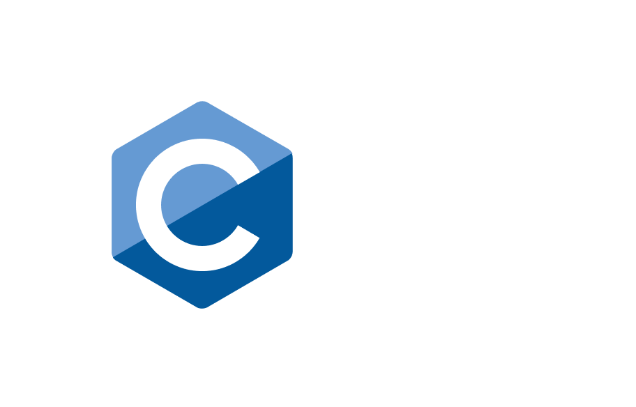
  
  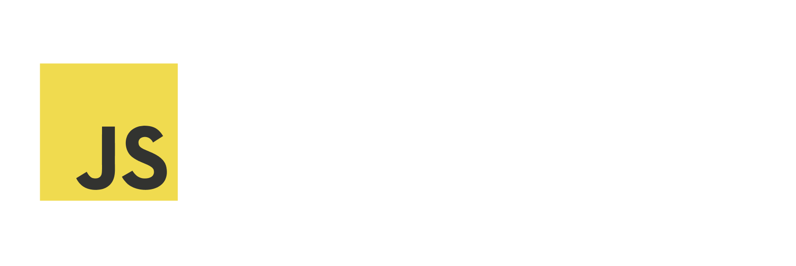

## Web stack
Even if it's not my current focus, my programming journey started mainly with web development.

  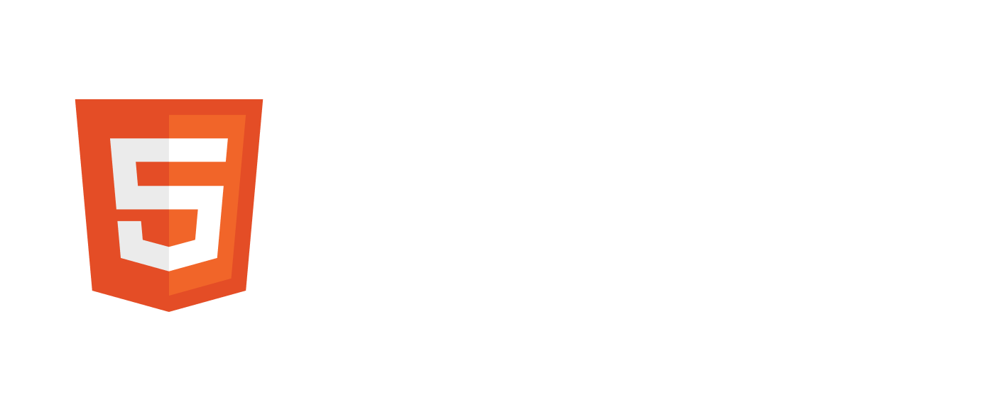
  
  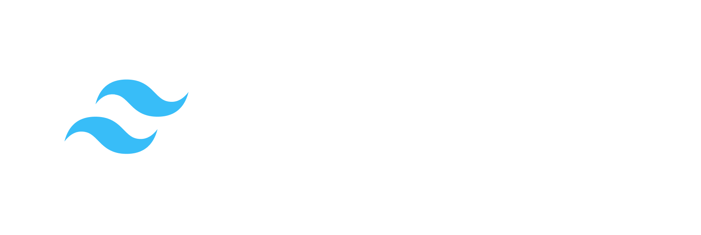
  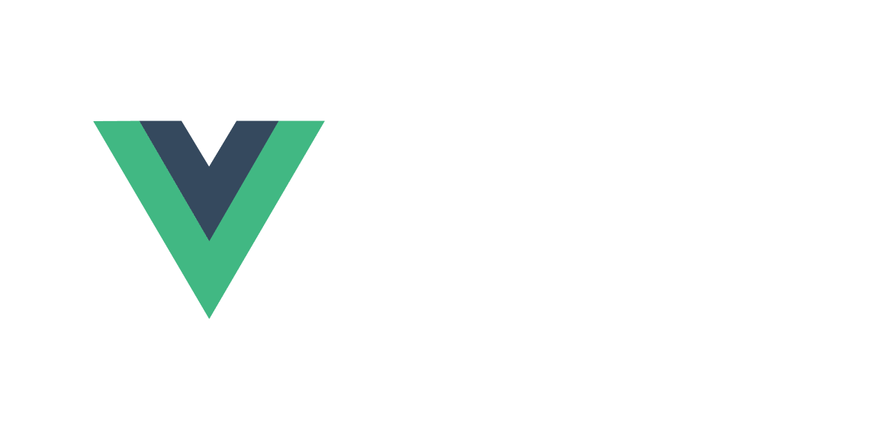
  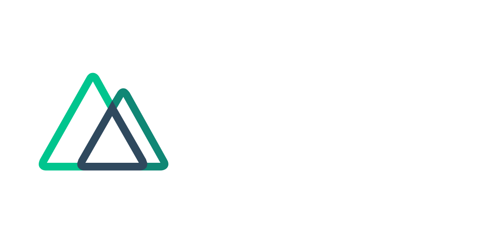
  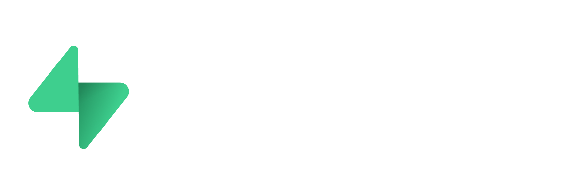

## Other technologies
Languages or technologies I've used in university or I've started learning on my own.

  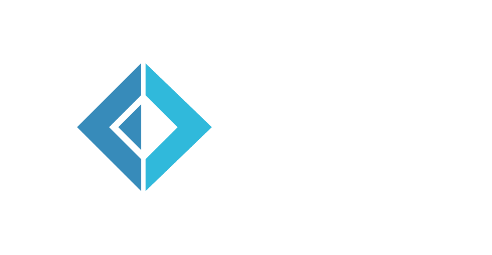
  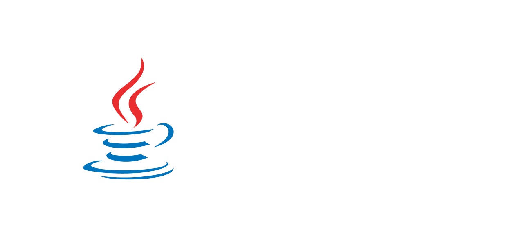
  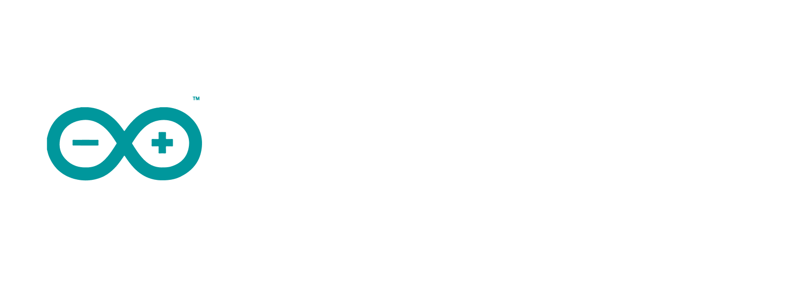
  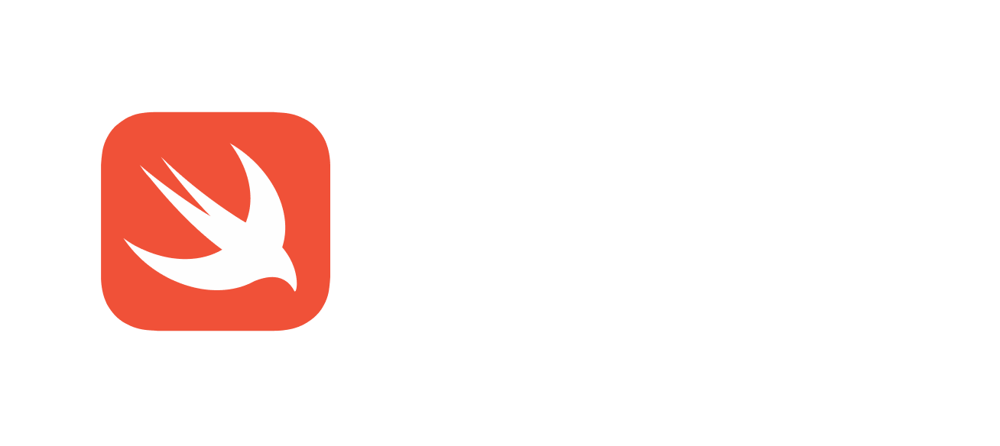
  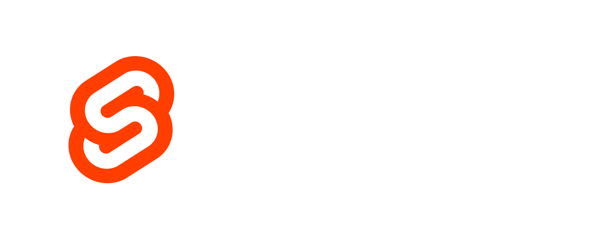

