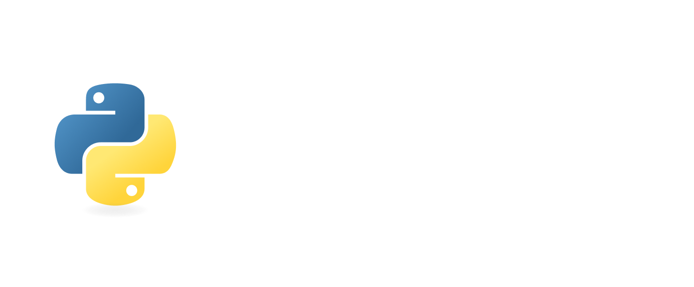
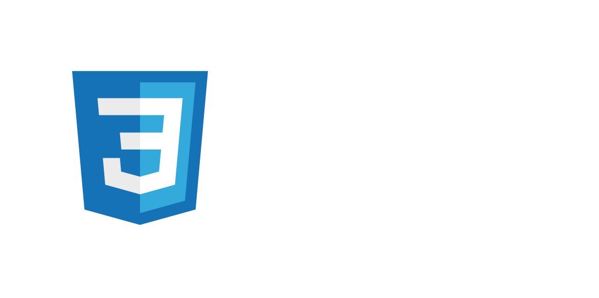

Tech enthusiast and programmer. 🔋 Currently pursuing a bachelor's in Computer Science at the University of Genoa. 🔌

## Main stack

  
  
  
  

### Web stack

  
  
  
  
  
  

### Other technologies

  
  
  
  
  

